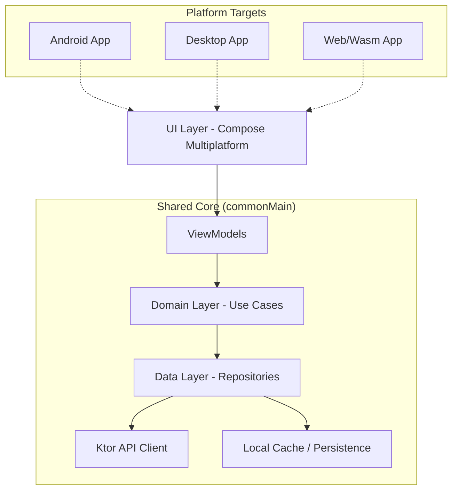

# Fleet Management Back Office

A modern **Kotlin Multiplatform** application designed for comprehensive fleet management, targeting **Android**, **Desktop (JVM)**, and **Web (Wasm/JS)**.

## 🚀 Tech Stack

- **Multiplatform Framework**: [Compose Multiplatform](https://github.com/JetBrains/compose-multiplatform)
- **Language**: [Kotlin](https://kotlinlang.org/) (2.1.0+)
- **Dependency Injection**: [Koin](https://insert-koin.io/)
- **Networking**: [Ktor Client](https://ktor.io/) (with OkHttp, JS, and Darwin engines)
- **Serialization**: [Kotlinx Serialization](https://github.com/Kotlin/kotlinx.serialization)
- **Concurrency**: [Kotlinx Coroutines](https://github.com/Kotlin/kotlinx.coroutines)
- **Date/Time**:- **Date/Time**: [Kotlinx Datetime](https://github.com/Kotlin/kotlinx-datetime)
- **Image Loading**: [Coil 3](https://coil-kt.github.io/coil/)
- **Static Analysis**: [Detekt](https://detekt.dev/)
- **Security Scanning**: [Trivy](https://aquasecurity.github.io/trivy/)

## 🏗️ Architecture

The project follows **Clean Architecture** principles combined with the **MVVM** (Model-View-ViewModel) pattern in the `commonMain` module.

### Layer Breakdown

- **UI Layer**: Built with **Compose Multiplatform**. It consists of Screens and lifecycle-aware **ViewModels** that manage UI state.
- **Domain Layer**: Contains **Use Cases** that encapsulate specific business logic and rules (e.g., `ActivateRentalUseCase`, `AssignDriverUseCase`). This layer is independent of any data source.
- **Data Layer**: Implements **Repositories**. It coordinates data from the **Ktor API Client** and local storage/cache.

### Visual Architecture

---

## 🧪 Testing Stack

We maintain high code quality through a robust testing suite:

- **Runner**: **JUnit 5 (Jupiter)** for modern testing features.
- **Mocking**: **MockK** for powerful multiplatform mocking.
- **Assertions**: **AssertJ** for fluent and readable assertions.
- **Coverage**: **Kotlinx Kover** for comprehensive coverage measurement (HTML/XML).
- **Coroutines**: `kotlinx-coroutines-test` for virtual time testing.

---

## 🛡️ Quality & Security

The project maintains high standards through automated pipelines:

- **Code Quality**: **Detekt** analyzes code smells, complexity, and potential bugs.
- **Security Scan**: **Trivy** scans the filesystem and dependencies for known vulnerabilities.
- **Formatting**: **Spotless** enforces a consistent code style across the entire project.

---

## 🛠️ Essential Libraries

| Category | Library | Purpose |
| :--- | :--- | :--- |
| **DI** | `Koin` | Dependency Injection for KMP. |
| **Networking** | `Ktor` | Multi-engine HTTP client. |
| **UI Components** | `Material 3` | Modern Material Design components. |
| **Charts** | `Charty` | Declarative charts for Compose. |
| **Security** | `KSafe` | Simplified secure storage. |
| **Validation** | `Internal` | Custom field and business rule validation. |

---

## 📂 Project Structure

- `composeApp/src/commonMain`: Shared UI and business logic.
- `composeApp/src/androidMain`: Android-specific entry point and implementation.
- `composeApp/src/wasmJsMain`: Web/Wasm specific wiring.
- `iosApp`: iOS application entry point (SwiftUI).

---

## 🤖 CI/CD Pipeline

We use **GitHub Actions** for our automated pipeline (`.github/workflows/ci.yml`):
1. **Linting**: Runs Spotless to ensure formatting.
2. **Testing**: Executes all unit tests and generates coverage reports via Kover.
3. **Code Quality**: Runs Detekt analysis to identify architectural debt.
4. **Security Scan**: Executes Trivy to find vulnerabilities (results in the Security tab).

---

## ⚡ Build and Run

### Run Options
- **Android**: `./gradlew :composeApp:assembleDebug`
- **Desktop**: `./gradlew :composeApp:run`
- **Web (Wasm)**: `./gradlew :composeApp:wasmJsBrowserDevelopmentRun`
- **Lint Check**: `./gradlew spotlessCheck`
- **Code Quality**: `./gradlew detekt`
- **Unit Tests**: `./gradlew test`
- **Coverage**: `./gradlew koverHtmlReport`

---

Learn more about [Kotlin Multiplatform](https://www.jetbrains.com/help/kotlin-multiplatform-dev/get-started.html) and [Compose Multiplatform](https://github.com/JetBrains/compose-multiplatform/).