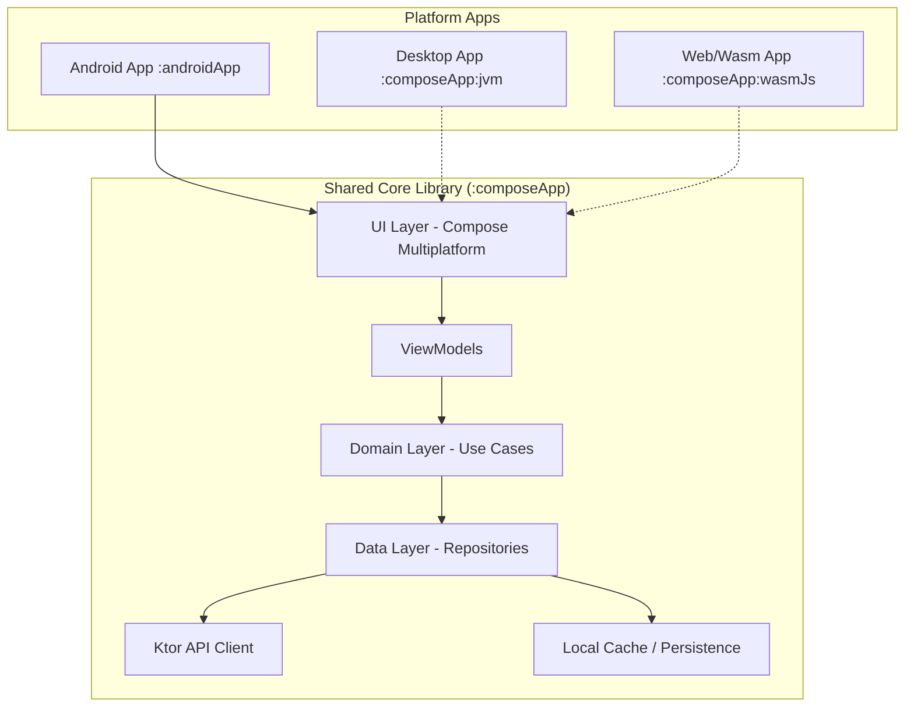

# Fleet Management Back Office

A modern **Kotlin Multiplatform** application designed for comprehensive fleet management, targeting **Android**, **Desktop (JVM)**, and **Web (Wasm/JS)**.

## 🚀 Tech Stack

- **Multiplatform Framework**: [Compose Multiplatform](https://github.com/JetBrains/compose-multiplatform)
- **Language**: [Kotlin](https://kotlinlang.org/) (2.1.0+)
- **Dependency Injection**: [Koin](https://insert-koin.io/)
- **Networking**: [Ktor Client](https://ktor.io/) (with OkHttp, JS, and Darwin engines)
- **Serialization**: [Kotlinx Serialization](https://github.com/Kotlin/kotlinx.serialization)
- **Concurrency**: [Kotlinx Coroutines](https://github.com/Kotlin/kotlinx.coroutines)
- **Date/Time**: [Kotlinx Datetime](https://github.com/Kotlin/kotlinx-datetime)
- **Image Loading**: [Coil 3](https://coil-kt.github.io/coil/)
- **Static Analysis**: [Detekt](https://detekt.dev/)
- **Security Scanning**: [Trivy](https://aquasecurity.github.io/trivy/)

## 🏗️ Architecture

The project follows **Clean Architecture** principles combined with the **MVVM** (Model-View-ViewModel) pattern. We use a **Modular Split** architecture to ensure long-term compatibility with future Android Gradle Plugin (AGP 9.0+) standards.

### Modular Structure

- **`:composeApp`**: A **Pure Kotlin Multiplatform** library containing all shared UI (Compose), ViewModels, Domain logic, and Data repositories. It supports JVM and WasmJs targets.
- **`:androidApp`**: The platform-specific Android application. It depends on `:composeApp` and handles Android-only concerns like Intents, Services, and Previews.

### Visual Architecture

---

# 🧪 Testing & Quality

We maintain high code quality through a robust testing and analysis suite:

### Unit Testing
- **Hierarchical Logs**: Optimized `jvmTest` output providing a detailed class and method-level breakdown.
- **Mocking**: Fake Repositories and `kotlinx-coroutines-test` for virtual time testing.
- **Command**: `./gradlew :composeApp:jvmTest`

### Code Coverage (Jacoco)
- **Visual Table**: A custom reporter prints a per-class coverage table directly in your terminal.
- **Threshold**: Enforced at **40%** minimum for the core business logic.
- **Report**: `./gradlew :composeApp:jacocoJvmTestReport` (Generates HTML in `build/reports`)
- **Verify**: `./gradlew :composeApp:jacocoJvmTestCoverageVerification`

### Static Analysis
- **Detekt**: Analyzes code smells and architectural debt.
- **Spotless**: Enforces consistent formatting across all modules (excluding `:androidApp`).
- **Command**: `./gradlew detekt` or `./gradlew spotlessCheck`

---

## 🏗️ Architecture

The project follows **Clean Architecture** principles combined with the **MVVM** pattern.

### Modular Breakout
To ensure compatibility with future **Android Gradle Plugin (AGP 9.0+)** standards, we use a **Modular Split** architecture:

1. **`:composeApp`**: A **Pure Kotlin Multiplatform** library. Contains all shared UI (Compose), ViewModels, Domain, and Data logic. Targets JVM and WasmJs.
2. **`:androidApp`**: The platform-specific Android application shell. Handles Android-only concerns like Intents and Manifests.

---

## 📂 Project Structure

- `composeApp/src/commonMain`: Shared UI and business logic.
- `androidApp/src/main/kotlin`: Android application entry point.
- `composeApp/src/commonTest`: Shared unit tests and fake repositories.

---

## ⚡ Build and Run

### Run Options
- **Android**: `./gradlew :androidApp:installDebug`
- **Desktop**: `./gradlew :composeApp:run`
- **Web (Wasm)**: `./gradlew :composeApp:wasmJsBrowserDevelopmentRun`
- **Web Production Bundle**: `./gradlew :composeApp:wasmJsBrowserDistribution`

### Web Environment Setup
- Local web development uses `http://localhost:8080` and `ws://localhost:8080` by default.
- Production web deployments read runtime values from `composeApp/src/webMain/resources/config.js`.
- GitHub Actions production bundle builds read these repository secrets:
    - `FLEET_API_BASE_URL_PROD`
    - `FLEET_WS_BASE_URL_PROD`
- Automatic Render deployment after the production build also requires:
    - `RENDER_DEPLOY_HOOK_URL`
- Render deployment is configured in `render.yaml` and expects these environment variables to be set in Render:
    - `FLEET_API_BASE_URL`
    - `FLEET_WS_BASE_URL`
- The generated static site is published from `composeApp/build/dist/wasmJs/productionExecutable`.

### Maintenance
- **Force Format**: `./gradlew spotlessApply`
- **Full Quality Check**: `./gradlew detekt spotlessCheck jvmTest jacocoJvmTestReport`

---

Learn more about [Kotlin Multiplatform](https://www.jetbrains.com/help/kotlin-multiplatform-dev/get-started.html) and [Compose Multiplatform](https://github.com/JetBrains/compose-multiplatform/).