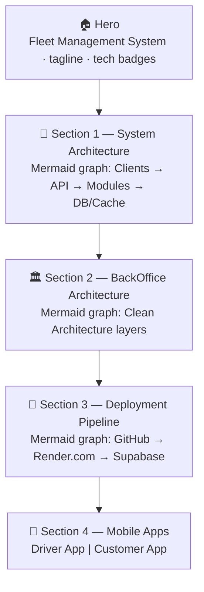
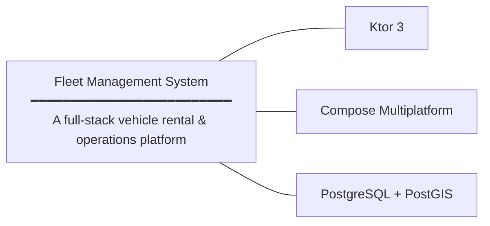
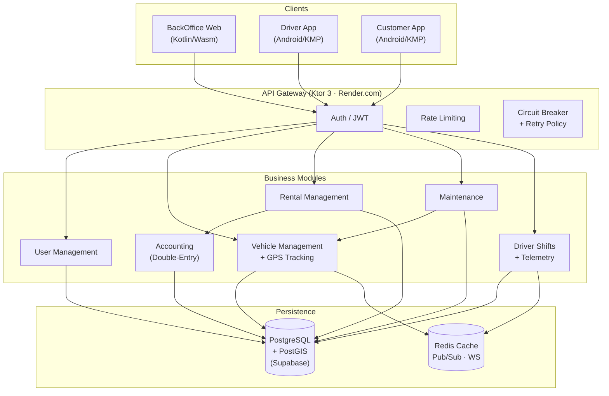
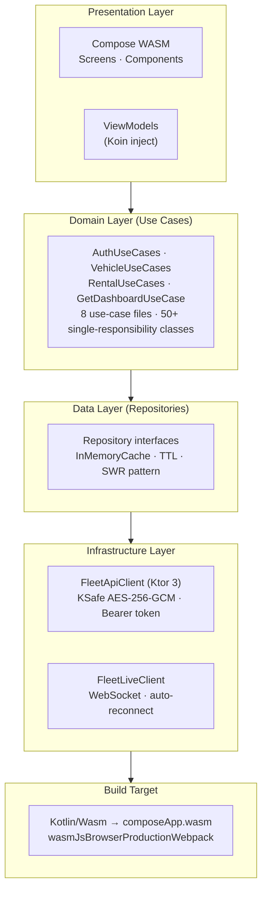
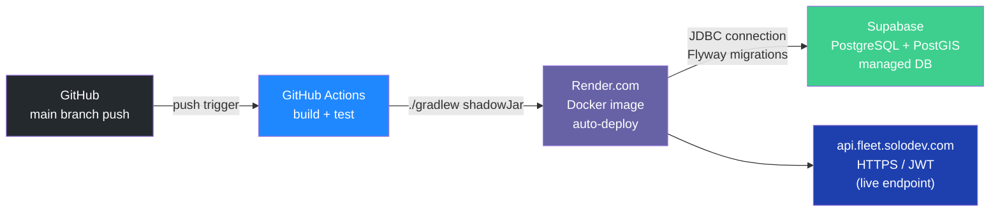
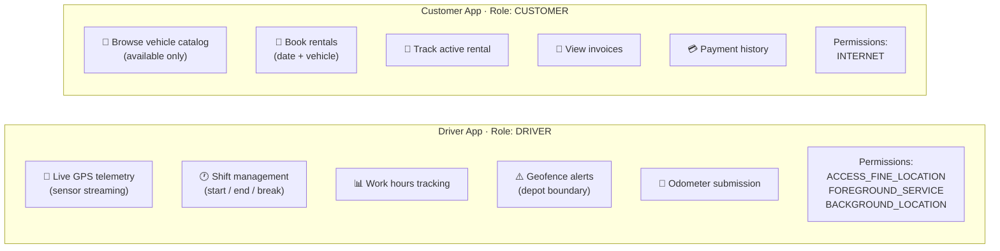

# Phase 13 — Architecture & System Overview

> **Status**: `IN PROGRESS` — `ArchitectureScreen.kt` + `MermaidViewer.kt` delivered; interactive Compose-native diagram composables pending
> **Prerequisite**: Phase 2 (auth session needed to resolve logged-in user role)
> [← Back to master plan](../web-backoffice-implementation-plan.md)

**Goal**: A scrollable `/architecture` screen that serves as an interactive onboarding demo — explaining the complete Fleet Management architecture to new staff members, technical stakeholders, or during a live product demo. The page renders a Mermaid.js system diagram via an HTML overlay positioned precisely over the Compose WASM canvas.

---

## Layout Overview



---

## Route & Navigation

- Route: `Screen.Architecture` (`/architecture`)
- Sidebar item: `Icons.Default.Schema` — **`Icons.Outlined.AccountTree` does NOT exist**
- Visible to **all authenticated roles** — no route guard needed
- `MermaidViewer` composable renders the diagram as a `position:fixed` HTML overlay on top of the Compose WASM canvas

---

## 13.1 Hero Section



### Deliverables
- [ ] `HeroSection` composable — large title + subtitle + tech badge row
- [ ] `TechBadge(label, icon)` — pill-shaped chip with icon, used across all sections
- [x] Static system diagram rendered via `MermaidViewer.kt` overlay

---

## 13.2 System Architecture Diagram

> ✅ **Delivered** — This is the live diagram shown in `ArchitectureScreen.kt` via `MermaidViewer`.



### Deliverables
- [x] `MermaidViewer.kt` — wasmJs HTML overlay, `position:fixed`, synced via `onGloballyPositioned`
- [x] `ArchitectureScreen.kt` — renders the system diagram with header + Refresh button
- [x] `window.renderMermaid(id, def, x, y, w, h)` in `index.html` — creates overlay div at exact Compose Box coordinates
- [x] `window.removeMermaidOverlay(id)` — disposes overlay on navigation away (`DisposableEffect`)
- [ ] `SystemArchitectureDiagram` native Compose canvas fallback (optional — deferred)

---

## 13.3 BackOffice Architecture Section

> The dependency flow: each layer only imports the layer directly below it. No skipping.



### Deliverables
- [ ] `BackofficeArchitectureSection` composable — stacked `LayerCard` rows with gradient tier colours
- [ ] `LayerCard(title, subtitle, chips)` — full-width card with accent colour per layer
- [ ] Tech highlights per layer as `TechBadge` chips
- [ ] Section header: \"Backoffice Architecture\"

---

## 13.4 Deployment Pipeline



### Deliverables
- [ ] `DeploymentSection` composable — horizontal `Row` of step cards with connecting arrows
- [ ] `DeployStepCard(icon, title, lines)` — icon + title + bullet lines
- [ ] Section header: \"Deployment\"

---

## 13.5 Mobile Apps Section



### Deliverables
- [ ] `MobileAppsSection` composable — `Row` (wide) / `Column` (narrow) of two `AppProfileCard`s
- [ ] `AppProfileCard(role, accentColor, features, permissions)` — card with role badge, feature bullets, permission chips
- [ ] `FeatureBullet(text)` — CheckCircle icon + Text row
- [ ] `PermissionChip(name)` — outlined chip with lock icon
- [ ] Section header: \"Mobile Apps\"

---

## Shared Composables (new in this phase)

| Composable | Location | Reused by |
|---|---|---|
| `MermaidViewer(content, modifier)` | `components/common/` | ArchitectureScreen (delivered ✅) |
| `TechBadge(label, icon?)` | `components/overview/` | Hero, Architecture, Deployment |
| `SectionHeader(title, subtitle)` | `components/overview/` | All 4 sections |
| `DiagramNodeCard(node)` | `components/overview/` | System Architecture (optional native fallback) |
| `LayerCard(title, subtitle, chips)` | `components/overview/` | Backoffice Architecture |
| `DeployStepCard(icon, title, lines)` | `components/overview/` | Deployment |
| `AppProfileCard(...)` | `components/overview/` | Mobile Apps |

---

## MermaidViewer Implementation Notes

> **wasmJs constraints** — these MUST be followed when modifying `MermaidViewer.kt`:

| Rule | Reason |
|---|---|
| `js()` calls must be in top-level function bodies with explicit `: Unit` return type | Kotlin/Wasm restriction — `js()` is not allowed in lambdas or nested scopes |
| Do **NOT** use `asDynamic()` | Deprecated in Kotlin/Wasm — use top-level `js()` interop or `@JsFun` external declarations |
| Use `style.setProperty("key", "value")` — **not** `style.overflow = "..."` | Direct property access bindings are missing for most CSS properties in Kotlin/Wasm DOM |
| The Compose WASM canvas covers the full viewport — plain DOM elements are invisible behind it | Use `position:fixed` + `onGloballyPositioned` coordinates to overlay the HTML element |
| `DisposableEffect` must call `window.removeMermaidOverlay(id)` | Without disposal the overlay div persists after navigation away |

### Current JS bridge (`index.html`)

```javascript
// Called by MermaidViewer via jsRenderMermaid(id, def, x, y, w, h)
window.renderMermaid = async (id, definition, x, y, w, h) => {
    let el = document.getElementById(id);
    if (!el) {
        el = document.createElement('div');
        el.id = id;
        Object.assign(el.style, {
            position: 'fixed', zIndex: '10',
            overflow: 'auto', display: 'flex',
            alignItems: 'flex-start', justifyContent: 'center',
        });
        document.body.appendChild(el);
    }
    // Sync position with Compose Box coordinates from onGloballyPositioned
    Object.assign(el.style, { left: x+'px', top: y+'px', width: w+'px', height: h+'px' });
    // Render (skips if definition unchanged)
    const { svg } = await mermaid.render('graphDiv_' + id, definition);
    el.innerHTML = svg;
};

// Called by DisposableEffect onDispose
window.removeMermaidOverlay = (id) => document.getElementById(id)?.remove();
```

---

## Caching Behavior

None — this screen is entirely static. No repository, no network calls, no `InMemoryCache`.

---

## Navigation Integration

```kotlin
// ✅ ALREADY IMPLEMENTED in AppShell.kt
NavItem("Architecture", Icons.Default.Schema, Screen.Architecture)

// ✅ ALREADY IMPLEMENTED in AppRouter
composable(Screen.Architecture.route) {
    ArchitectureScreen()
}
```

---

## Verification

- [x] `/architecture` route is accessible from sidebar for all authenticated roles
- [x] `MermaidViewer` renders the system graph diagram on the Architecture screen
- [x] HTML overlay is positioned exactly over the Compose Box (no offset/gap)
- [x] Navigating away removes the overlay div (`DisposableEffect` disposal verified)
- [x] `Icons.Default.Schema` used — `AccountTree` references removed
- [ ] All 4 sections render without errors on wide (≥ 1200 dp) and narrow (< 800 dp) viewports
- [ ] Connector lines in native Compose diagram variant connect the correct nodes visually (optional)
- [ ] `TechBadge`, `SectionHeader` composables are reused across all 4 sections
- [ ] No network calls made from this screen (`0` Ktor requests in dev tools)
- [ ] Page scrolls smoothly end-to-end with no frame drops
